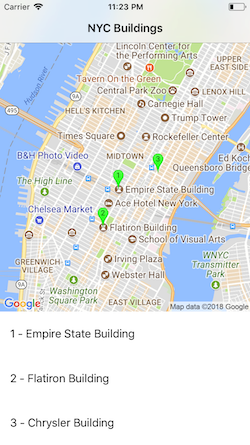

# StaticMapRequestBuilder

A lightweight helper to create URLs for the Google Maps Static API with type safety.



## Installation

StaticMapRequestBuilder is available through [CocoaPods](https://cocoapods.org). To install
it, simply add the following line to your Podfile:

```ruby
pod 'StaticMapRequestBuilder'
```

## Usage

### Quick Start

```swift

let mapSize = CGSize(width: 300, height: 200)
let coord = CLLocationCoordinate2D(latitude: 40.7484, longitude: -73.9857)
let marker = Marker(coordinate: coord, color: .blue)

let mapRequestUrl = MapRequestBuilder(withSize: mapSize)
    .addCenter(.address("Midtown Manhattan, New York, NY"))
    .addMarker(marker)
    .addZoom(13)
    .imageFormat(.png)
    .mapType(.roadmap)
    .retinaScale()
    .build()


//Load image from mapRequestUrl

if let url = mapRequestUrl {
    imageView.kf.setImage(with: url)
}

```

## License

StaticMapRequestBuilder is available under the MIT license. See the LICENSE file for more info.
